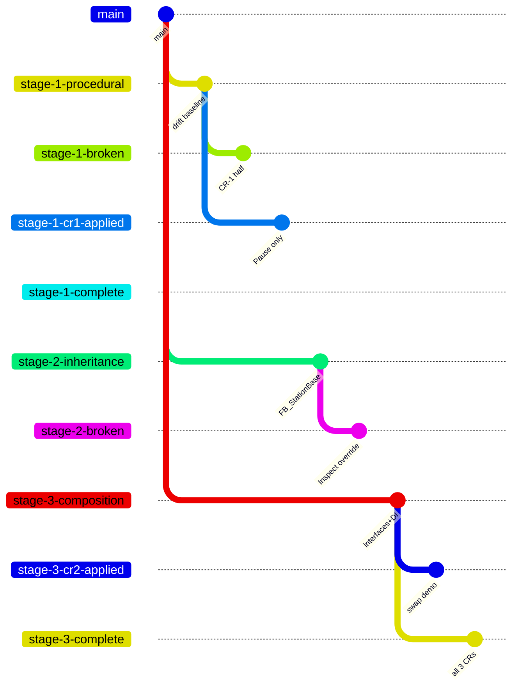

# Getting started

Hands-on quickstart after you've cloned the repo. For pre-workshop setup (TwinCAT, Git, libraries), see [Prerequisites](workshop/prerequisites.md).

## First five minutes

```fish
git clone https://github.com/Mark-Code-Cowboys/NEM_Workshop.git
cd NEM_Workshop
git switch stage-1-procedural
explorer NEM2026/NEM2026.sln    # Windows; macOS: open / Linux: xdg-open
```
``` gitKraken for switching branches
close XAE if open
check for branch under Local and Remote
if under Remote, then right-click it and then select Checkout origin/stage-1-procedural
if it doesn't work because changes were made when you opened the project then you'll need to revert first
go to files in the unstaged area and undo changes
if under Local right click and select Checkout origin/stage-1-procedural
create your own branch stage-1-procedural-name
now open the solution
```

When XAE loads:

1. Solution Explorer (left) → expand `FillingLine Project` → `POUs/`
2. Double-click `MAIN.TcPOU`
3. Press `F7` (Build Solution) — should complete without errors
4. Look at the four `FB_Station*` files — they're the stars of Stage 1

That's enough to confirm your setup works. Don't activate / login / run yet — we'll do that during the workshop.

## Branch navigation

Every workshop checkpoint is its own branch. Switching branches in TwinCAT XAE is the workshop's main interaction loop:

```fish
git switch stage-1-procedural   # clean baseline
git switch stage-1-broken       # pedagogical broken state
git switch stage-1-cr1-applied  # CR-1 alone
git switch stage-1-complete     # all 3 CRs applied

# Stage 2 family
git switch stage-2-inheritance
git switch stage-2-broken
git switch stage-2-cr2-applied
# ...

# Stage 3 family
git switch stage-3-composition
git switch stage-3-cr2-applied   # the headline swap demo
git switch stage-3-complete
```

!!! tip "XAE doesn't auto-reload on branch switch"
    After switching branches in your shell, **close and re-open the solution in XAE** to see the new state. Or `File → Recent Solutions → NEM2026.sln`. If you stay in XAE while the underlying files change, the editor will show stale content.

### Branch tree



### Branch role table

| Pattern | What it shows |
|---|---|
| `stage-X-{procedural,inheritance,composition}` | Clean baseline of each methodology |
| `stage-X-broken` | Pedagogically-staged "half-applied" or wrong-way state |
| `stage-X-crN-applied` | One CR applied in isolation — single-commit diff vs. baseline |
| `stage-X-cr2-applied` *(stage 3 only)* | The architectural CR-2 answer key (alarm strategy + sequencer swap) |
| `stage-X-complete` | All 3 CRs applied — the methodology's final answer |

## Inside the solution

```
NEM2026/                            # TwinCAT project root
├── NEM2026.sln                     # ← open this in XAE
├── NEM2026.tspproj                 # TwinCAT system project (refs FillingLine.plcproj)
└── FillingLine/                    # the PLC project
    ├── FillingLine.plcproj         # library refs (varies per branch family)
    ├── PlcTask.TcTTO               # task: 10 ms cycle, priority 20
    ├── POUs/                       # programs / FBs / methods
    │   ├── Interfaces/             # Stage 3 only — SOLID contracts
    │   ├── BuildingBlocks/         # Stage 3 only — composable primitives
    │   ├── Stations/               # Stage 3 only — composed stations
    │   ├── FB_Station*.TcPOU       # Stages 1 & 2 — flat at this level
    │   ├── FB_StationBase.TcPOU    # Stage 2 only
    │   └── MAIN.TcPOU              # cyclic entry point
    ├── DUTs/                       # struct types
    └── _Libraries/                 # resolved library cache (committed for offline use)
```

## Driving the code

When you're ready to *run* the line (not just compile):

1. Solution Explorer → right-click `NEM2026` → **Activate Configuration** (uses local runtime if no target is configured)
2. **Login** (lightning-bolt icon in toolbar)
3. **Start** (`F5`)

In MAIN's online view, drive the workflow by writing to PLC variables:

| Variable | Effect |
|---|---|
| `Execute := TRUE` | Triggers the start of a cycle on stations that are idle |
| `ModeAuto := TRUE` | Enables auto mode (required for all stations to leave Idle) |
| `ModeManual := TRUE` | Manual mode — stations don't auto-progress |
| `ModePause := TRUE` *(post-CR-1 branches only)* | Hold |
| `AlarmAck := TRUE` *(briefly)* | Acknowledge any latched alarms |
| `PartFill / PartCap / PartLabel / PartInspect := TRUE` | Tell each station a part is present at its position |
| `FlowRate / TorqueActual / InspectResult / etc.` | Drive the per-station gating conditions |

Write `Execute := TRUE; ModeAuto := TRUE; PartFill := TRUE; FlowRate := 1.0; TargetVolume := 250.0` and you'll see Fill open its valve, accumulate, and complete.

## Reading the diffs

The scoreboard is generated from real `git diff --stat` output. To see any cell yourself:

```fish
git diff stage-1-procedural...stage-1-cr1-applied --stat
```

For full file content:

```fish
git diff stage-1-procedural...stage-1-cr1-applied
```

Or open the GitHub compare URL:

```
https://github.com/Mark-Code-Cowboys/NEM_Workshop/compare/stage-1-procedural...stage-1-cr1-applied
```

[See all the cells →](workshop/scoreboard.md){ .md-button .md-button--primary }

## Building these docs locally

If you want to read the docs site offline (or check what's changed):

=== "Linux/macOS"

    ```fish
    ./serve-docs.sh
    # → http://localhost:8000
    ```

=== "Windows"

    ```cmd
    serve-docs.cmd
    REM → http://localhost:8000
    ```

=== "Manual setup"

    ```fish
    python3 -m venv .venv-docs
    source .venv-docs/bin/activate.fish    # bash: .venv-docs/bin/activate
    pip install -r requirements-docs.txt
    mkdocs serve
    ```

Pages auto-reload on save. To produce a static `site/` directory for sharing or hosting:

```fish
./serve-docs.sh build       # or serve-docs.cmd build
```

## When something doesn't work

| Symptom | Most likely cause |
|---|---|
| XAE complains about library versions on branch switch | The placeholder refs differ between stage families. XAE may offer to download from the configured NuGet feeds, or use the bundled `_Libraries/`. Either is fine. |
| Build error: "function block X not found" | Branch swapped while solution was open. **Close and re-open NEM2026.sln.** |
| Build error: "ModePause is not an input variable" | You're on `stage-1-broken` — that branch is intentionally broken. Switch to a working branch. |
| `git switch stage-1-broken` fails with "destination is not a commit" | Repo wasn't fetched after a recent push. `git fetch origin` then retry. |
| Activate Configuration prompts for license | First-time activation — pick the 7-day demo license (sufficient for the workshop). |

For anything that's not in this table, post in the workshop chat or grab the instructor.
