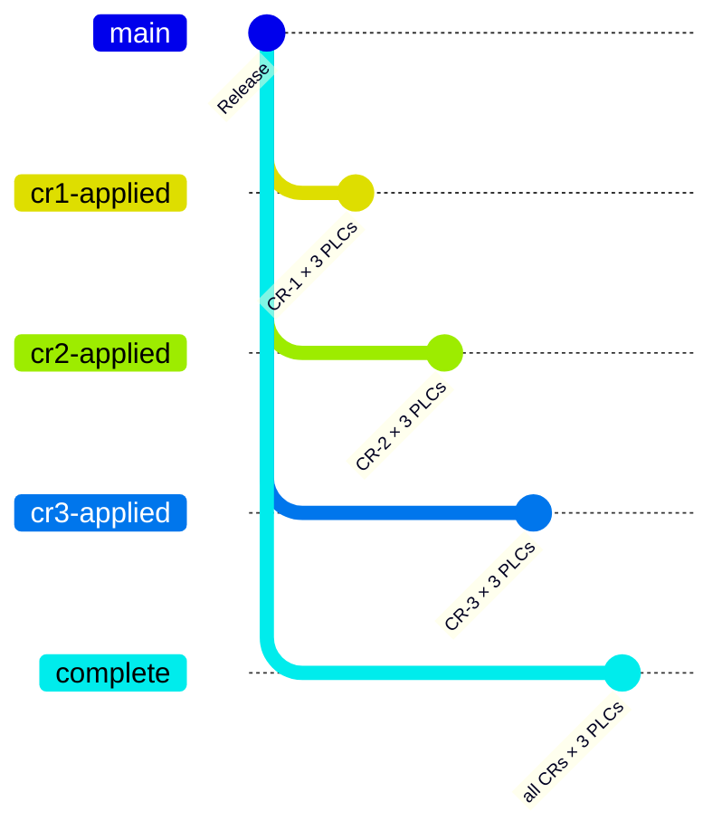

# Getting started

Hands-on quickstart after you've cloned the repo. For pre-workshop setup (TwinCAT, Git, libraries), see [Prerequisites](workshop/prerequisites.md).

## First five minutes

```fish
git clone https://github.com/Mark-Code-Cowboys/NEM_Workshop.git
cd NEM_Workshop
git switch Release
explorer NEM2026/NEM2026.sln    # Windows; macOS: open / Linux: xdg-open
```

When XAE loads, you'll see **three PLC projects** side-by-side in Solution Explorer:

1. `FillingLine_Procedural` — Stage 1's plain-ST implementation
2. `FillingLine_Inheritance` — Stage 2's SPT-base-class implementation
3. `FillingLine_Composition` — Stage 3's interfaces + DI implementation

For a quick sanity check:

1. Expand any one project → `POUs/` → double-click `MAIN.TcPOU`
2. Press `F7` (Build Solution) — all three PLCs should compile without errors
3. Compare the same station across the three projects (e.g. `FB_StationFill.TcPOU` in each) to see the architectural difference for yourself

That's enough to confirm your setup works. Don't activate / login / run yet — we'll do that during the workshop.

## Branch navigation

The workshop uses **five branches** — one baseline + three CR snapshots + a cumulative end-state. Each branch carries all three PLC projects; the difference between branches is which CRs have been applied to *each PLC*.

```fish
git switch Release        # pre-class baseline — three implementations, no CRs
git switch cr1-applied    # CR-1 applied across all 3 PLC projects
git switch cr2-applied    # CR-2 applied across all 3 PLC projects
git switch cr3-applied    # CR-3 applied across all 3 PLC projects
git switch complete       # all 3 CRs cumulative — post-class end state
```

!!! tip "XAE doesn't auto-reload on branch switch"
    After switching branches in your shell, **close and re-open the solution in XAE** to see the new state. Or `File → Recent Solutions → NEM2026.sln`. If you stay in XAE while the underlying files change, the editor will show stale content.

### Branch tree



### Branch role table

| Branch | What it shows |
|---|---|
| `Release` | Pre-class baseline. All three PLC projects in their initial methodology-pure state. No CRs applied. |
| `cr1-applied` | CR-1 (Pause mode) applied to **all three** PLC projects independently. Diff vs. `Release` per PLC shows how each architecture absorbs the same CR. |
| `cr2-applied` | CR-2 (non-faulting alarms + parallel camera/reject) applied to all three PLC projects. The headline blast-radius comparison. |
| `cr3-applied` | CR-3 (cycle data logging in Fill + Inspect only) applied to all three PLC projects. |
| `complete` | All three CRs cumulative. The post-class end state. |

The 20 `stage-*` branches from the previous workshop iteration are kept as a historical record — diff them if you want to see how the workshop evolved, but you can ignore them for active use.

## Inside the solution

```
NEM2026/                                # TwinCAT solution root
├── NEM2026.sln                         # ← open this in XAE
├── NEM2026.tsproj                      # System project: 3 tasks, 3 <Plc> instances
├── FillingLine_Procedural/
│   ├── FillingLine_Procedural.plcproj  # Tc2_Standard + Tc3_Module — no framework
│   ├── PlcTask_Pr.TcTTO                # 10 ms / priority 20 / AmsPort 851
│   ├── POUs/
│   │   ├── MAIN.TcPOU                  # cyclic entry — orchestrates 4 stations
│   │   └── FB_Station*.TcPOU           # 4 stations, flat (no shared base)
│   └── _Libraries/                     # library cache (committed for offline use)
├── FillingLine_Inheritance/
│   ├── FillingLine_Inheritance.plcproj # + SPT-Libraries
│   ├── PlcTask_In.TcTTO                # 10 ms / priority 21 / AmsPort 852
│   └── POUs/
│       ├── MAIN.TcPOU
│       ├── FB_StationBase.TcPOU        # SPT-derived station base class
│       └── FB_Station*.TcPOU           # 4 stations, all extend FB_StationBase
└── FillingLine_Composition/
    ├── FillingLine_Composition.plcproj # + Core / CoreComponents / MechatronicsCore
    ├── PlcTask_Co.TcTTO                # 10 ms / priority 22 / AmsPort 853
    ├── DUTs/                           # ST_LogEntry etc.
    └── POUs/
        ├── MAIN.TcPOU
        ├── Interfaces/                 # SOLID contracts
        ├── BuildingBlocks/             # composable primitives (sequencer, alarm handler, …)
        └── Stations/                   # 4 stations composed from building blocks
```

Each PLC project is independent — its own task, its own AmsPort, its own library refs, its own POU tree. The same station name (e.g. `FB_StationFill`) appears in all three projects but is *not* shared between them; each is a separate file with the paradigm-specific implementation.

## Driving the code

When you're ready to *run* the line (not just compile):

1. Solution Explorer → right-click `NEM2026` → **Activate Configuration** (uses local runtime if no target is configured)
2. **Login** (lightning-bolt icon in toolbar)
3. **Start** (`F5`)

In MAIN's online view, drive the workflow by writing to PLC variables:

| Variable | Effect |
|---|---|
| `Execute := TRUE` | Triggers the start of a cycle on stations that are idle |
| `ModeAuto := TRUE` | Enables auto mode (required for all stations to leave Idle) |
| `ModeManual := TRUE` | Manual mode — stations don't auto-progress |
| `ModePause := TRUE` *(post-CR-1 branches only)* | Hold |
| `AlarmAck := TRUE` *(briefly)* | Acknowledge any latched alarms |
| `PartFill / PartCap / PartLabel / PartInspect := TRUE` | Tell each station a part is present at its position |
| `FlowRate / TorqueActual / InspectResult / etc.` | Drive the per-station gating conditions |

Write `Execute := TRUE; ModeAuto := TRUE; PartFill := TRUE; FlowRate := 1.0; TargetVolume := 250.0` and you'll see Fill open its valve, accumulate, and complete.

## Reading the diffs

The scoreboard is generated from real `git diff --stat` output. To see any cell yourself, diff the CR branch against `Release` and filter to one PLC project:

```fish
# CR-1's blast radius on the Procedural implementation
git diff Release...cr1-applied --stat -- NEM2026/FillingLine_Procedural/

# Same CR on the Inheritance implementation
git diff Release...cr1-applied --stat -- NEM2026/FillingLine_Inheritance/

# Same CR on the Composition implementation
git diff Release...cr1-applied --stat -- NEM2026/FillingLine_Composition/
```

For full file content drop the `--stat`. Or open the GitHub compare URL:

```
https://github.com/Mark-Code-Cowboys/NEM_Workshop/compare/Release...cr1-applied
```

[See all the cells →](workshop/scoreboard.md){ .md-button .md-button--primary }

## Building these docs locally

If you want to read the docs site offline (or check what's changed):

=== "Linux/macOS"

    ```fish
    ./serve-docs.sh
    # → http://localhost:8000
    ```

=== "Windows"

    ```cmd
    serve-docs.cmd
    REM → http://localhost:8000
    ```

=== "Manual setup"

    ```fish
    python3 -m venv .venv-docs
    source .venv-docs/bin/activate.fish    # bash: .venv-docs/bin/activate
    pip install -r requirements-docs.txt
    mkdocs serve
    ```

Pages auto-reload on save. To produce a static `site/` directory for sharing or hosting:

```fish
./serve-docs.sh build       # or serve-docs.cmd build
```

## When something doesn't work

| Symptom | Most likely cause |
|---|---|
| XAE complains about library versions on solution open | Library placeholder refs differ per PLC project (Procedural uses fewer libraries than Composition). XAE may offer to download from the configured NuGet feeds, or use the bundled per-project `_Libraries/`. Either is fine. |
| Build error: "function block X not found" | Branch swapped while solution was open. **Close and re-open NEM2026.sln.** |
| Only one PLC project visible in Solution Explorer | The `.sln` may have stale config. Verify `git status` is clean on the current branch and you opened `NEM2026/NEM2026.sln` (not `NEM2026.tspproj` directly). |
| `git switch cr1-applied` fails with "destination is not a commit" | Repo wasn't fetched after a recent push. `git fetch origin` then retry. |
| Activate Configuration prompts for license | First-time activation — pick the 7-day demo license (sufficient for the workshop). |

For anything that's not in this table, post in the workshop chat or grab the instructor.
