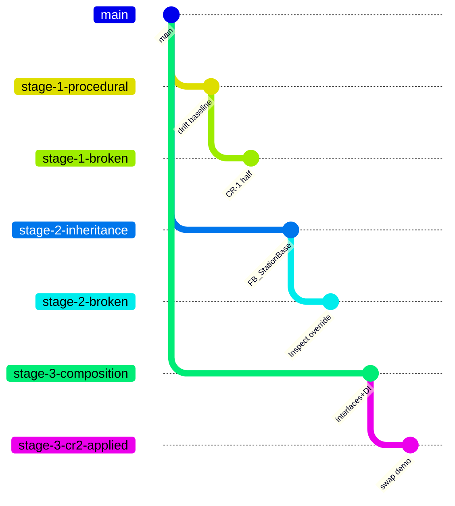

# Getting started

This is a **Beckhoff TwinCAT 3** project. There is no command-line build — TwinCAT compiles only via the XAE (eXtended Automation Engineering) Visual Studio shell on Windows.

## Prerequisites

- Windows 10 or 11
- [TwinCAT 3 XAE](https://www.beckhoff.com/en-us/products/automation/twincat/te1xxx-twincat-3-engineering/te1000.html), version **3.1.4026** or newer
    - The Visual Studio shell installs automatically with XAE — you don't need a separate Visual Studio install
- Git client (GitKraken, command-line, or VS built-in all work)
- A target runtime (optional for static review):
    - Local: TwinCAT runtime on the same Windows host
    - Remote: any Beckhoff CX or IPC running TwinCAT 3 with route configured

For Stage 2 and Stage 3 you'll also need the Beckhoff USA libraries:

- **Stage 2** — [SPT-Libraries](https://beckhoff-usa-community.github.io/SPT-Libraries/) (`SPT Base Types`, `SPT Components`, `SPT Diagnostic`, `SPT Event Logger`, `SPT Utilities`)
- **Stage 3** — Core libraries (`Core`, `CoreComponents`)

Both library families are pre-resolved into `NEM2026/FillingLine/_Libraries/` so XAE can resolve placeholders offline. You don't need to install them separately unless you want to update versions.

## Cloning

```fish
git clone https://github.com/Mark-Code-Cowboys/NEM_Workshop.git
cd NEM_Workshop
```

## Branch navigation

Every workshop checkpoint is its own branch. Switch to the branch you want, then open the solution.



| Branch family | What it shows |
|---|---|
| `stage-X-procedural` / `inheritance` / `composition` | The clean baseline of each methodology |
| `stage-X-broken` | A pedagogically-staged "half-applied" or wrong-way state |
| `stage-X-crN-applied` | One CR applied in isolation (single-commit diff vs baseline) |
| `stage-X-complete` | All 3 CRs applied — the methodology's final answer |

```fish
# Pick a starting point
git switch stage-1-procedural

# Open the solution in XAE
explorer NEM2026/NEM2026.sln    # Windows; macOS: open / Linux: xdg-open
```

## Inside the solution

The PLC project is `NEM2026/FillingLine/`. The PLC task `PlcTask` runs on a 10 ms cycle and calls `MAIN`. Every branch's `MAIN.TcPOU` shows the wire-up specific to that stage.

!!! tip "Use Visual Studio's Diff View"
    XAE doesn't have a built-in branch comparator, but the underlying VS shell does — install the **Git Changes** window (View → Git Changes) and you can diff `MAIN.TcPOU` or any FB across branches without leaving the IDE.

## Activating + running

If you have a target runtime configured:

1. Right-click **NEM2026** in Solution Explorer → **Activate Configuration**
2. **Login** (the lightning-bolt icon)
3. **Start** (F5)

Drive the workflow by writing to the PLC variables in `MAIN`:

- `Execute := TRUE` to start a cycle
- `ModeAuto := TRUE` to enable auto mode
- Set per-station inputs (`PartFill`, `FlowRate`, `PartCap`, `CapFeederReady`, `TorqueActual`, `PartLabel`, `LabelReady`, `PartInspect`, `CameraReady`, `InspectResult`) to drive each station's gating conditions

## Reading the diffs

The scoreboard is generated from real `git diff --stat` output. To see any cell yourself:

```fish
git diff stage-1-procedural...stage-1-cr1-applied --stat
```

Or open the GitHub compare URL:

```
https://github.com/Mark-Code-Cowboys/NEM_Workshop/compare/stage-1-procedural...stage-1-cr1-applied
```

[See all the cells →](workshop/scoreboard.md){ .md-button .md-button--primary }

## Building these docs locally

```fish
python3 -m venv venv
source venv/bin/activate.fish        # bash: venv/bin/activate
pip install -r requirements-docs.txt
mkdocs serve
```

Then open <http://localhost:8000>. Pages auto-reload on save.

To build a static site:

```fish
mkdocs build       # output in site/
```
