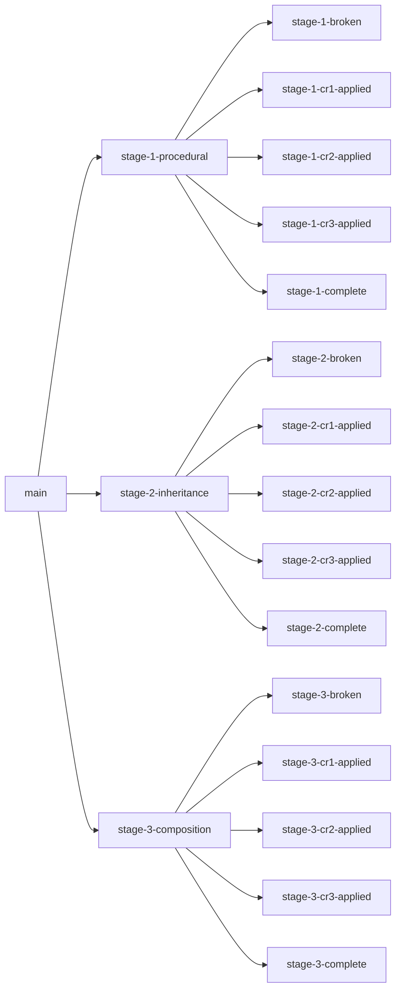

# Stages overview

Three stages, one filling line, three architectures.

## At a glance

| | Stage 1 — Procedural | Stage 2 — Inheritance | Stage 3 — Composition |
|---|---|---|---|
| **Build** | One FB per station, copy-pasted | `FB_StationBase` + 4 children | Composed from small interface-typed FBs |
| **Framework** | Plain ST, `Tc2_Standard` only | [SPT-Libraries](https://beckhoff-usa-community.github.io/SPT-Libraries/) | Beckhoff USA `Core` + custom interfaces |
| **Mode/alarm/HMI** | Duplicated in every station | Lives on base FB once | Composed services, swappable |
| **CR friction** | Every CR touches every station | Base class becomes the constraint | One-line swaps, zero blast |
| **Best fit** | One-off panels, single machine | A family of similar machines | Test-driven, multi-machine OEM |

## Branch tree

Each stage has the same shape: a clean baseline, a `-broken` pedagogical state, four `crN-applied` answer keys (one per CR plus `complete`).

## When to teach which stage

Don't try to teach all three to a brand-new audience without a checkpoint:

- **Stage 1 alone** — useful for an audience that already writes procedural and just needs to see the limits more clearly. Maybe a 60-minute talk, not a workshop.
- **Stage 1 → Stage 2** — useful when the audience has already heard "use inheritance" and wants to see the trade-offs honestly. Two-hour module.
- **Stage 1 → Stage 2 → Stage 3** — the full four-hour workshop. Best for an audience that's hit cross-cutting pain in production but doesn't have the vocabulary yet.

## Pick a stage

-   :material-numeric-1-circle:{ .lg .middle } **Stage 1 — Procedural**

    ---

    Four monolithic Function Blocks with deliberate copy-paste drift. The duplication problem made vivid.

    [→ Stage 1 deep dive](procedural.md)

-   :material-numeric-2-circle:{ .lg .middle } **Stage 2 — Inheritance**

    ---

    Refactor to `FB_StationBase` extending the SPT-Libraries `FB_ComponentBase`. Genuine wins, real limits.

    [→ Stage 2 deep dive](inheritance.md)

-   :material-numeric-3-circle:{ .lg .middle } **Stage 3 — Composition**

    ---

    Stations composed from interface-typed building blocks. Strategy, Template Method, Dependency Injection — all by name.

    [→ Stage 3 deep dive](composition.md)

